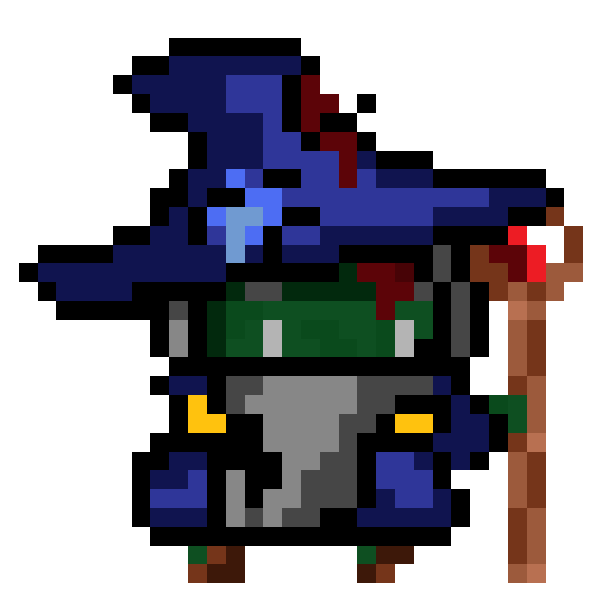

 # Project Overview

The gameplay will be a reimagined version of Space Invaders mixed with a classic Dungeon crawler.
The main goal of the game will be to slay all the zombie wizards on levels that get more and more difficult as you progress to save your dog whos been kidnapped by the final boss.


## New GamePlay
- Simple spells/abilities for both player and enemies
- A boss battle at the end
- Drops/Loot
- Health bars
- shielding
- Multiple weapon and enemy types
- Additional Controls


## Gameplay (copy from document)
The gameplay will be a reimagined version of Space Invaders mixed with a classic Dungeon crawler.
The main goal of the game will be to kill all the zombie wizards to save your dog, going through levels that gradually get more difficult until you come across the boss.

The player’s weapon will be a rifle, while the zombies are able to use different spells depending on the level.
For example:

LVL 1: basic lasers 
LVL 2: Ice magic (When the player is hit they will be frozen for 1 second) 
LVL 3: Fire magic (Player takes tick dmg when hit)
LVL 4: Teleportation (Enemy randomly teleports every second)
LVL 5: Voodoo (Whenever the player hits an enemy, they take ⅓ of the dmg (To overcome this LVL you need to figure out how to get the wizard zombies to kill each other)

(and so forth)

Throughout the LVLs players will have the ability to unlock the wizard zombie’s spells for themselves. Randomly after at least half the enemies are killed an orb will drop. The player will have to shoot said orb multiple times for it to be destroyed, gaining that LVLs abilities.

Abilities will be used to help progress through the game, as well as killing the boss and saving your dog.
During the LVLs a few random enemies will be able to regenerate health with healing potions, if killed these particular zombie wizards will drop healing potions
The Boss:
The boss will be an old grey zombie wizard, the grandmaster of all wizards. Having spells the player is yet to verse. 
(possible spells: 
- blindness (Player cannot see the UI as well as a proportion of the screen)
-Kanehaneha! (a giant laser beam(changed spelling for legal issues))
- minions

During the boss battle Donny is held by the boss. During the battle you need to be careful not to shoot Donny
When the boss has 1 hp left the dog bites the necromancer's hand and finishes him off.

Statistics:


Health:
Player health: 30
Enemy health: 15 (goes up 5 per lvl)
Boss health: 100
Dog health: 10

Damage(basic shots):
Player: 5 (changes depending on spell)
Enemy: (depends on LVL)
Boss: 6
Dog: 1

Health Potions:
Player: +10hp (+1 per second for 5 seconds)
Enemy: +5hp
Boss: +15hp

Spells:
Shielding - 10 shield 
Fire 2 tick dmg per second (if fireball = hits 4 other enemies around them)
Ice 1 tick damage per second (enemies can't take damage when frozen) (frozen for 1-2 second(s)
Voodoo (⅓ rd of the damage done to enemies)

FIRE: (all tick dmg)
Fireball - fireball that deals damage to others around
Pyro shot - long fire beam with dropoff
Firewall - a giant fire wall that makes any basic shots have basic tick (1dps)
ICE:
Freeze - freeze for 1 second on shot (1 tick dps)
Slip - makes it harder to control player
Ice shield - small shield (5hp)
DARK:
Voodoo - if you damage a enemy the player takes 1/3rd of the dmg
Blindness - cant see UI and the enemies in the back 2 rows
Can resurrect a teammate (takes 5 seconds)
MAGIC:
Randomly teleports 
Giant star shot at you
Makes decoy enemies 
EARTH:
Wall - builds a rock wall in front (10hp)
Quake - shakes screen
Hell - opens a large gap in the ground (careful you could fall in)
WATER:
ATTACK! - throws fish at you 6dps (if miss will flop on the ground)
Hydrate - sends a tidal wave

BOSS:
Full blindness
Teleportation
Shield
Summon minions
Regen 


LVLs:
Starts with 15 basic Z.Ws doing 5dps
Ice mages 5dps + ice spells
Fire mages 5dps + Fire spells
Magic mages 5dps + teleportation
Dark mages 6 dps + Voodoo and dark spells (like blindness)
Fire and ice 6 dps + mix of fire and ice
Earth mages 7 dps + earth spells
Water mages 7 dps + water spells
Mix of all
BOSS





 # Behaviour - User Journey


 # Planning Diagram - Project Plan


 ```mermaid
gantt
    title Project Game Plan
    dateFormat DD-MM-YY
    axisFormat %d-%B
    tickInterval 1week

    section Holidays
    School Holidays: 09-04-23, 22-04-23

    section Design
    Project Overview:05-04-23, 1d
    Project Plan: 05-04-23, 24-04-23
 ```
